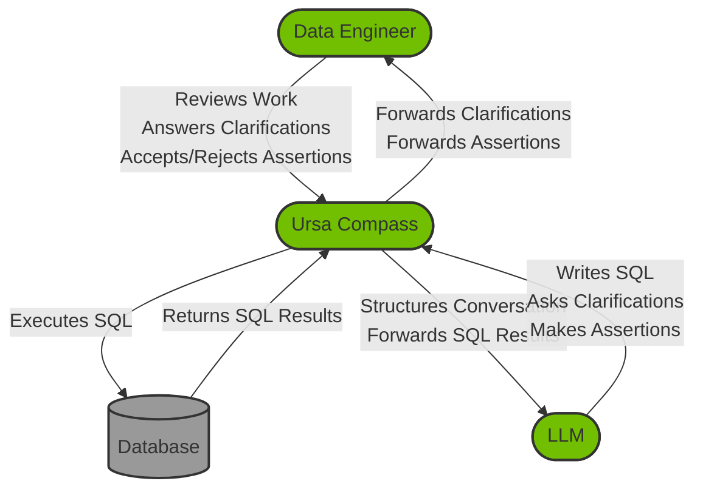

# Ursa Compass

Ursa Compass is a tool to help data engineers make sense of healthcare claims data packages. It sets up a three-way conversation between the data engineer, the LLM, and the procedural code of Ursa Compass.

Ursa Compass drives the conversation based on a series of questions in an editable prompts file. It poses the questions to the LLM, which has the option of running a SQL query, asking the data engineer for clarification, or attempting to answer the question with an assertion that can be accepted or rejected from the data engineer.



## How to use

There are three ways to use Ursa Compass.

#### Run Ursa Compass locally

The git repo of Ursa Compass ships with a sample implementation in Next.js, which can be run locally on your workstation, as follows:

```
 $ (cd engine && npm install)
 $ cd nextjs-app
 $ npm install
 $ npm run dev
```

You will want to set DATABASE_TYPE and TARGET_DATABASE_URL in `/nextjs-app/.env.local`. You can edit the prompts in the `prompts` directory to fit your workflow.

#### Integrate Ursa Compass into your application

The npm package of Ursa Compass contains just the engine, without the Next.js sample implementation, and it can be incorporated into an existing application. 

```
 $ npm install ursa-compass
```

You can look at the nextjs-app directory as a reference implementation, but usage will look something like:

```
const options = {
    log: (contents) => {
        sendLogToUser(contents);
    },
    prompts: {
        "investigate-pharmacy": "Override prompt text"
    },
    promptUser: async (message) => {
        const userResponse = await waitForSocketResponse();
        return userResponse;
    },
    query: async (sql, params) => {
        const result = await executeDatabaseQuery(sql, params);
        return result;
    },
    sendMessage: (message: string, type: string) => {
        sendMessageToUser(type || "message", { text: message });
    }
}
await investigate("pharmacy", tableName, existingDocumentation, options);
```

#### Use Ursa Studio

If you're looking to use Ursa Compass in the context of a battle-tested enterprise SaaS platform which covers the full breadth of healthcare data needs, contact sales@ursahealth.com and ask about Ursa Studio, which has Ursa Compass as one of its features.

## HIPAA concerns

Yes, PHI is absolutely going to be flowing through this system. What makes Ursa Compass HIPAA-compliant is that it uses AWS Bedrock and leverages your existing AWS account. You'll need to have an AWS account, with the BAA paperwork and all the other compliance steps in place.